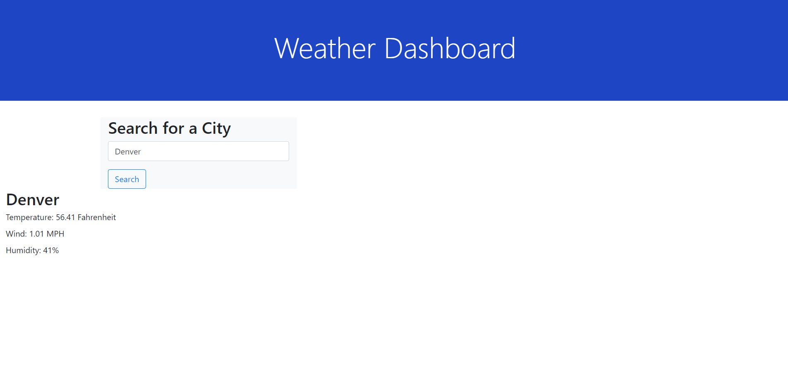

# Weather-Dashboard

## Task

For this assignment we were tksed with creating a weather dashboard that would display the weather for whatever location you entered in the search box. Once you searched for a city, the current weather along with the 5 day forecast would populate. Along with this it would save your searches below.

## Screenshot Image of Website

## Link to Website

https://dado7639.github.io/Weather-Dashboard/
